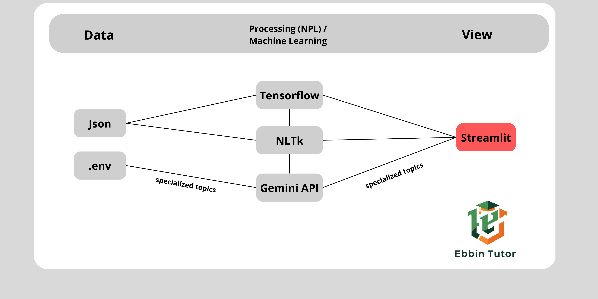

# EBBINTUTOR - Tutor Inteligente Basado en IA

 Proyecto desarrollado por el equipo NeuroBits como parte del Samsung Innovation Campus - SIC 2025

---

## Tabla de Contenido

1.  [Nombre del Proyecto](#nombre-del-proyecto)
2.  [Descripción del Proyecto](#descripción-del-proyecto)
3.  [Objetivos del Proyecto](#objetivos-del-proyecto)
4.  [Arquitectura del Sistema](#arquitectura-del-sistema)
5.  [Tecnologías Utilizadas](#tecnologías-utilizadas)
6.  [Evaluación y Validación](#evaluación-y-validación)
7.  [Impacto y Aplicaciones](#impacto-y-aplicaciones)
8.  [Conclusión](#conclusión)
9.  [Agradecimientos](#agradecimientos)

---

##  Nombre del Proyecto

*EBBINTUTOR*

---

##  Descripción del Proyecto

EBBINTUTOR es un modelo de tutoría inteligente basado en intenciones e inteligencia artificial, diseñado para proporcionar educación personalizada mediante técnicas avanzadas de Machine Learning (ML) y Procesamiento de Lenguaje Natural (NLP). Su arquitectura modular permite la integración con diversas plataformas y su optimización para entornos con acceso limitado a tecnología.

Inspirado en las investigaciones de Hermann Ebbinghaus sobre la memoria y el aprendizaje, EBBINTUTOR emplea un enfoque adaptativo para mejorar el proceso de enseñanza-aprendizaje.

---

##  Objetivos del Proyecto

* ✅ Implementar un sistema de tutoría basado en IA capaz de adaptar dinámicamente el contenido educativo en función del rendimiento y las necesidades del usuario.
* ✅ Desarrollar modelos de NLP que permitan una interacción conversacional fluida y contextualizada.
* ✅ Optimizar el acceso a la educación personalizada, especialmente en comunidades con recursos limitados.

---

##  Arquitectura del Sistema

EBBINTUTOR está compuesto por varios módulos interconectados:

1.  **Procesamiento de Lenguaje Natural (NLP)**
    * Tokenización, lematización y análisis sintáctico con NLTK.
2.  **Motor de Machine Learning**
    * Modelos de aprendizaje supervisado y no supervisado con TensorFlow/Keras
    * Optimización mediante técnicas de transferencia de aprendizaje
    * Evaluación del rendimiento a través de métricas de precisión y recall.
3.  **Plataforma de Interfaz y Visualización**
    * Implementación en Streamlit para accesibilidad web
    * Generación dinámica de contenido educativo basado en respuestas del usuario.
4.  **Base de Datos y Almacenamiento**
    * Estructuración de datos de entrenamiento con NumPy y Pandas.

---

## ️ Tecnologías Utilizadas

* ⭐ **Lenguaje:** Python 3.x
* ⭐ **Frameworks:** TensorFlow, Keras, Streamlit
* ⭐ **Procesamiento de Datos:** NumPy, Pandas
* ⭐ **Procesamiento de Lenguaje Natural (NLP):** NLTK
* ⭐ **Control de Versiones:** GitHub

---

##  Evaluación y Validación

El rendimiento del sistema se mide a través de:

* ✅ Precisión de predicción en la personalización del contenido educativo.
* ✅ Evaluación de impacto en la retención de conocimientos de los usuarios.
* ✅ Comparación del desempeño del modelo con técnicas tradicionales de enseñanza.

---

##  Impacto y Aplicaciones

EBBINTUTOR tiene aplicaciones en:

* ✅ Educación personalizada en entornos académicos y autodidactas.
* ✅ Optimización del aprendizaje mediante IA en entornos de bajo acceso tecnológico.

---

##  Estado de visualización actual del proyecto 

https://github.com/user-attachments/assets/0773cb32-609f-46ee-a2aa-aecefc0f92c1

---

##  Conclusión

EBBINTUTOR representa un avance significativo en la educación personalizada impulsada por inteligencia artificial. A través de técnicas de Machine Learning, Procesamiento de Lenguaje Natural y modelos de redes neuronales, hemos desarrollado una plataforma que no solo proporciona respuestas automatizadas, sino que aprende y se adapta a las necesidades individuales de cada estudiante.

Al final, nuestro objetivo fue mucho más que crear un sistema automatizado. Buscamos proporcionar un recurso que brinde respuestas útiles y precisas, facilitando el acceso a la información para los usuarios que la usen. Este proyecto no solo ha sido un ejercicio técnico, sino una experiencia enriquecedora que nos ha permitido aprender y mejorar.

En última instancia, nuestro objetivo con EBBINTUTOR es transformar la educación a través de la IA, ofreciendo una herramienta innovadora que potencie el aprendizaje y brinde oportunidades a quienes más lo necesitan. Este es solo el comienzo de un camino hacia el futuro de la educación digital. 

---

## ⭐ Agradecimientos ⭐

Agradecemos primeramente a DIOS por darnos sabiduría y paciencia para completar este proyecto, al equipo de Samsung por la oportunidad que nos dio de demostrar nuestro talento y las ganas de aprender a lo largo de este tiempo, y a nuestros familiares por el constante apoyo para con nosotros.

¡Equipo de NeuroBits!
